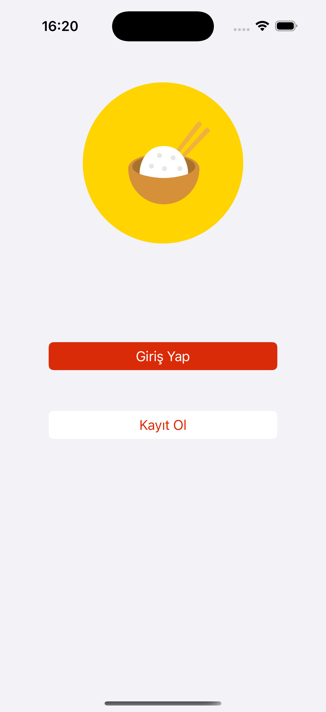
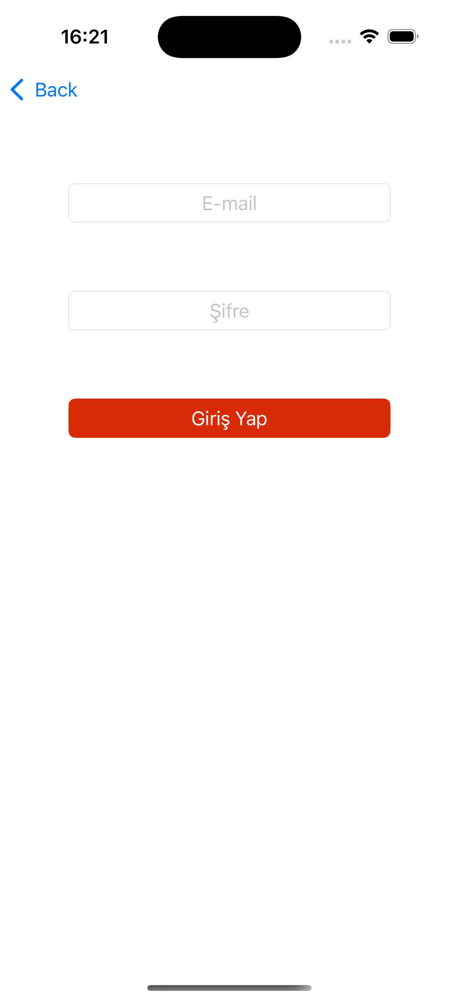
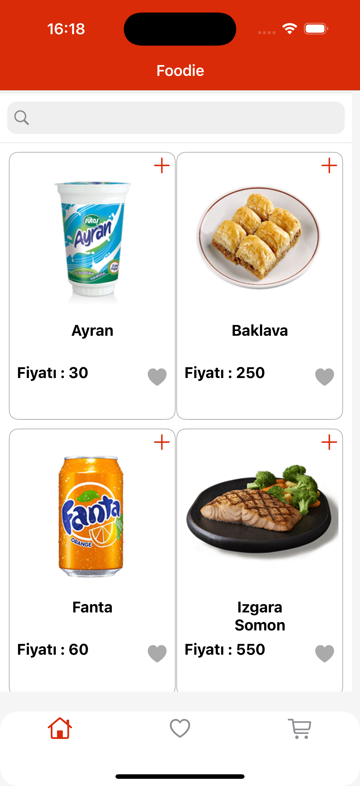
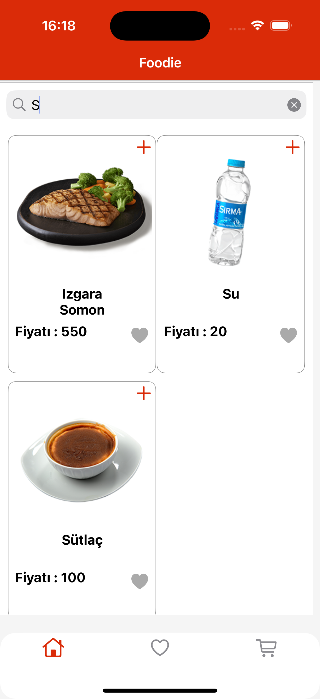
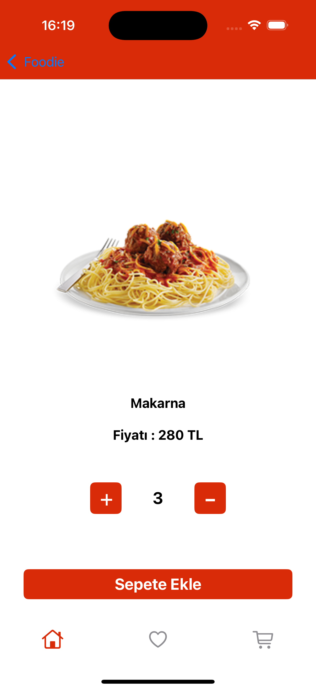
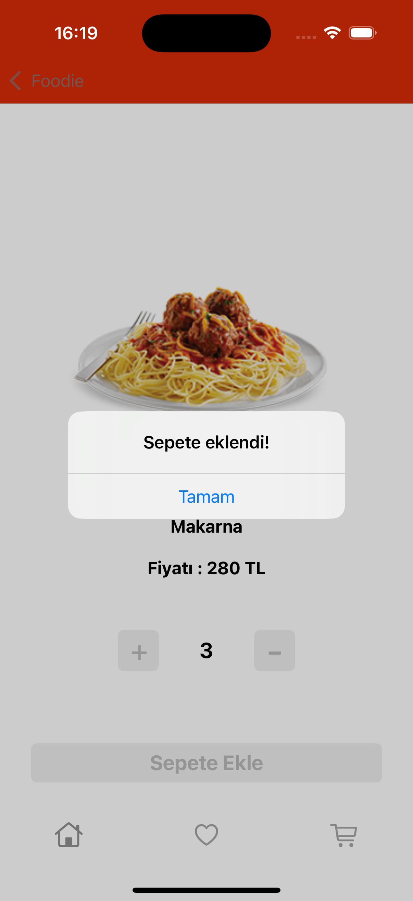
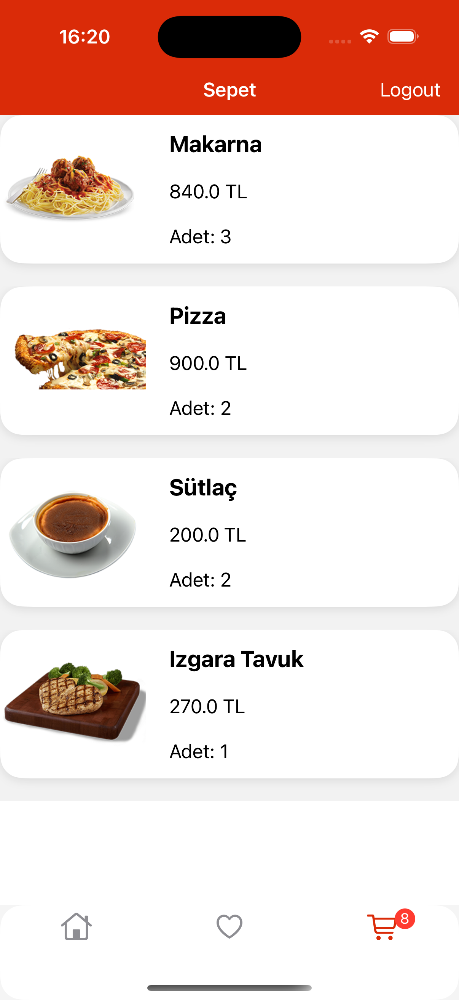
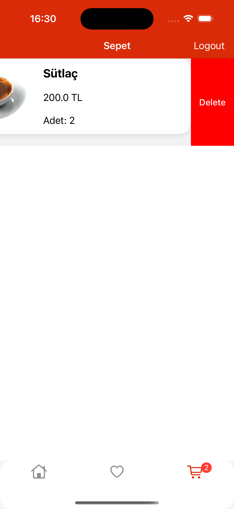

Foodie, geliştirdiğim bir yemek uygulamasıdır. Web servisinden yemekleri API ile çekip kullanıcıya sunan bir uygulamadır. API'yi çekmek için Alamofire ve görselleri yüklemek için Kingfisher kullandım. Bu uygulamada Firebase Authentication, MVVM, CollectionView ve TableView kullandım.

  
  
  
  

  
  
  
  

                                    

